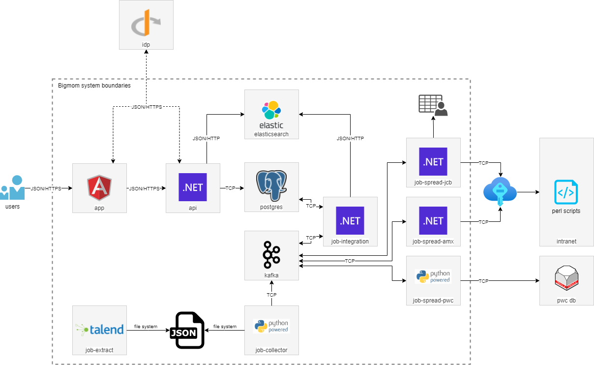

# Bigmom - Architecture

Cette page décrit l'architecture de Bigmom.

1. [Accueil](README.md)
2. [Spécification fonctionnelles](functional_spec.md)
3. [Spécification techniques](technical_spec.md)
4. [Architecture](architecture.md)
5. [Infrastructure](infrastructure.md)

## Architecture

L'achitecture est de type microservices. Les différents modules sont les suivants :

| Système           | Module            | Description                                                                                                                                      |
| ----------------- | ----------------- | ------------------------------------------------------------------------------------------------------------------------------------------------ |
| Bigmom            | `app`             | L'application frontend servant d'interface utilisateur.                                                                                          |
| Bigmom            | `api`             | L'API REST backebnd qui fournit les données au frontend.                                                                                         |
| Bigmom            | `job-extract`     | Le job permettant d'extraire les données du SITPE.                                                                                               |
| Bigmom            | `job-collector`   | Le job permettant de collecter les données extraites par `job-extract`, de le mettre en forme et de les envoyer à `job-integration` via `kafka`. |
| Bigmom            | `job-integration` | Le job permettant d'intégrer les données dans `postgres` et `elasticsearch`. C'est le coeur de Bigmom.                                           |
| Bigmom            | `job-spread-pwc`  | Le job permettant de mettre à jour les heures de télécollectes calculées dans `pwc db` pour le bancaire et privatif.                             |
| Bigmom            | `job-spread-amx`  | Le job permettant de mettre à jour les heures de télécollectes calculées dans `intranet` pour les adhérents AMEX.                                |
| Bigmom            | `job-spread-jcb`  | Le job permettant de récupérer les informations des adhérentes JCB dans `intranet` pour génération du fichier CSV.                               |
| Bigmom            | `postgres`        | La base de données de Bigmom.                                                                                                                    |
| Bigmom            | `kafka`           | Le middleware permettant l'échange des messages entre les différents modules de Bigmom.                                                          |
| Bigmom            | `elasticsearch`   | Le moteur de recherche permettant d'indéxer les données de Bigmom.                                                                               |
| Identity Provider | `idp`             | Le Single Sign On responsable de l'authentification pour l'accès à `app` et `api`.                                                               |
| Powercard         | `pwc db`          | La base de données de Powercard.                                                                                                                 |
| Intranet          | `intranet`        | L'intranet CSB où se trouvent les informations des adhérents AMEX et JCB.                                                                        |

Le schéma suivant permet d'illustrer les différentes connexions qui existent entre les modules :

Les modules sont développés avec les langages et frameworks suivants :

| Module            | Langage                 | Version | Framework         | Version  |
| ----------------- | ----------------------- | ------- | ----------------- | -------- |
| `app`             | C#/Typescript           | 9/4.3.2 | .NET/Angular      | 5/12.1.0 |
| `api`             | C#                      | 9       | .NET/ASP.NET Core | 5/5.0.8  |
| `job-extract`     | Java                    | 8       | Talend            | 7.3.1    |
| `job-collector`   | Python                  | 3.9     | N/A               | N/A      |
| `job-integration` | C#                      | 9       | .NET/ASP.NET Core | 5/5.0.8  |
| `job-spread-pwc`  | Python                  | 3.9     | N/A               | N/A      |
| `job-spread-amx`  | C#                      | 9       | .NET/ASP.NET Core | 5/5.0.8  |
| `job-spread-jcb`  | C#                      | 9       | .NET/ASP.NET Core | 5/5.0.8  |

Les briques logicielles utilisées le sont dans les versions suivantes :

| Brique            | Version |
| ----------------- | ------- |
| `nginx`           | 1.19.5  |
| `postgres`        | 13.1    |
| `kafka`           | 2.11    |
| `elasticsearch`   | 7.13.3  |