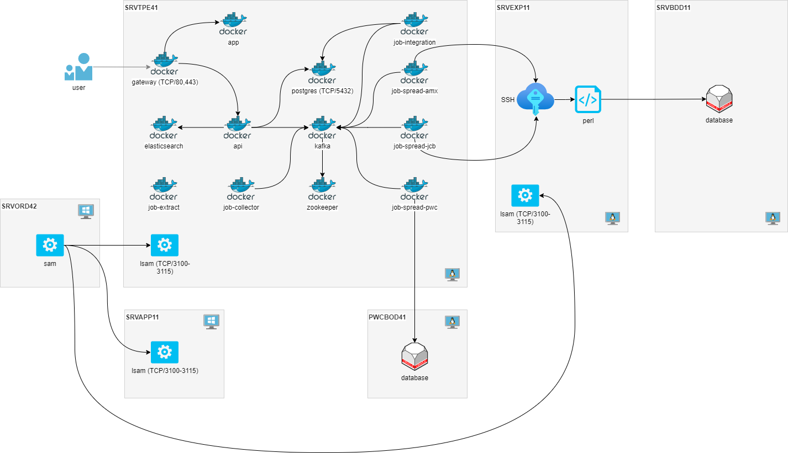

# Bigmom - Architecture

Cette page décrit l'infrastructure de Bigmom.

1. [Accueil](README.md)
2. [Spécification fonctionnelles](functional_spec.md)
3. [Spécification techniques](technical_spec.md)
4. [Architecture](architecture.md)
5. [Infrastructure](infrastructure.md)

## Infrastructure

L'infrastructure de Bigmom en production fait intervenir les serveurs suivants :

| Serveur   | Description                                                                                            |
| --------- | ------------------------------------------------------------------------------------------------------ |
| SRVTPE41  | Le serveur applicatif de Bigmom.                                                                       |
| SRVEXP11  | Le serveur applicatif de l'intranet.                                                                   |
| SRVBDD11  | Le serveur de base de données de l'intranet où se trouvent les informations des adhérents AMEX et JCB. |
| SRVAPP11  | Le serveur métier ATM où se trouve la base de données du SITPE.                                        |
| PWCBOD41  | Le serveur de base de données Powercard.                                                               |
| SRVORD42  | Le serveur du SAM Opcon.                                                                               |

L'infrastructure de Bigmom en recette fait intervenir les serveurs suivants :

| Serveur       | Description                                                                                            |
| ------------- | ------------------------------------------------------------------------------------------------------ |
| SRVTPEB1      | Le serveur applicatif de Bigmom.                                                                       |
| SRVEXPA1      | Le serveur applicatif de l'intranet.                                                                   |
| SRVBDDA       | Le serveur de base de données de l'intranet où se trouvent les informations des adhérents AMEX et JCB. |
| SRVAPPA1      | Le serveur métier ATM où se trouve la base de données du SITPE.                                        |
| PWCBOD41_213  | Le serveur de base de données Powercard.                                                               |
| SRVORDT1      | Le serveur du SAM Opcon.                                                                               |