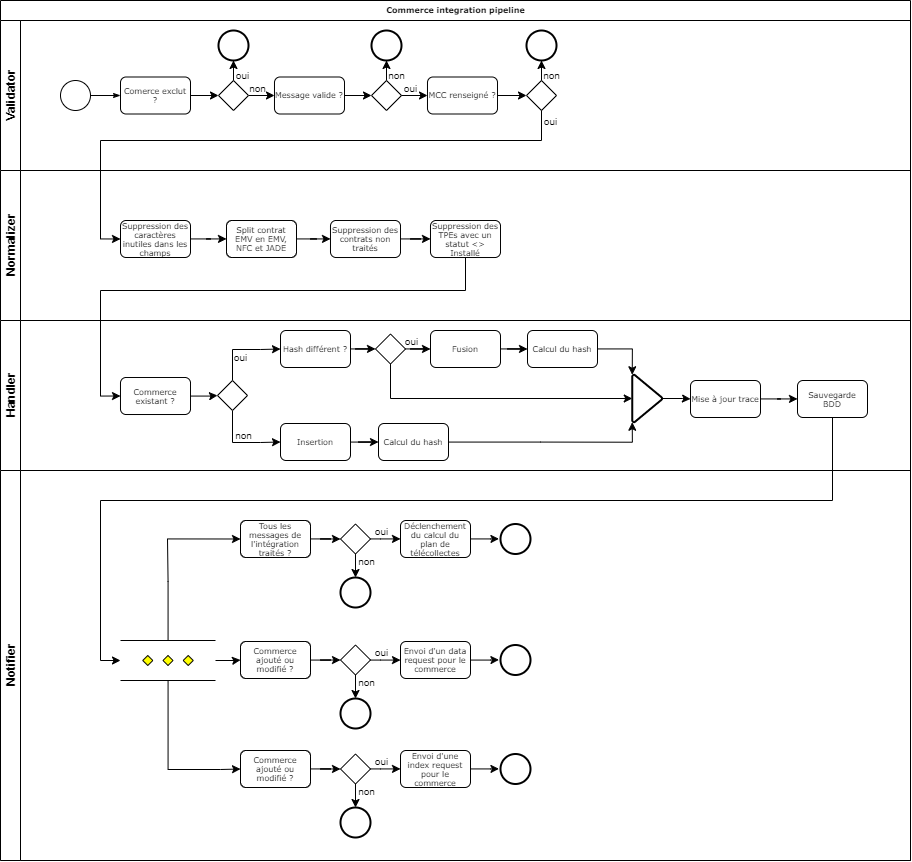
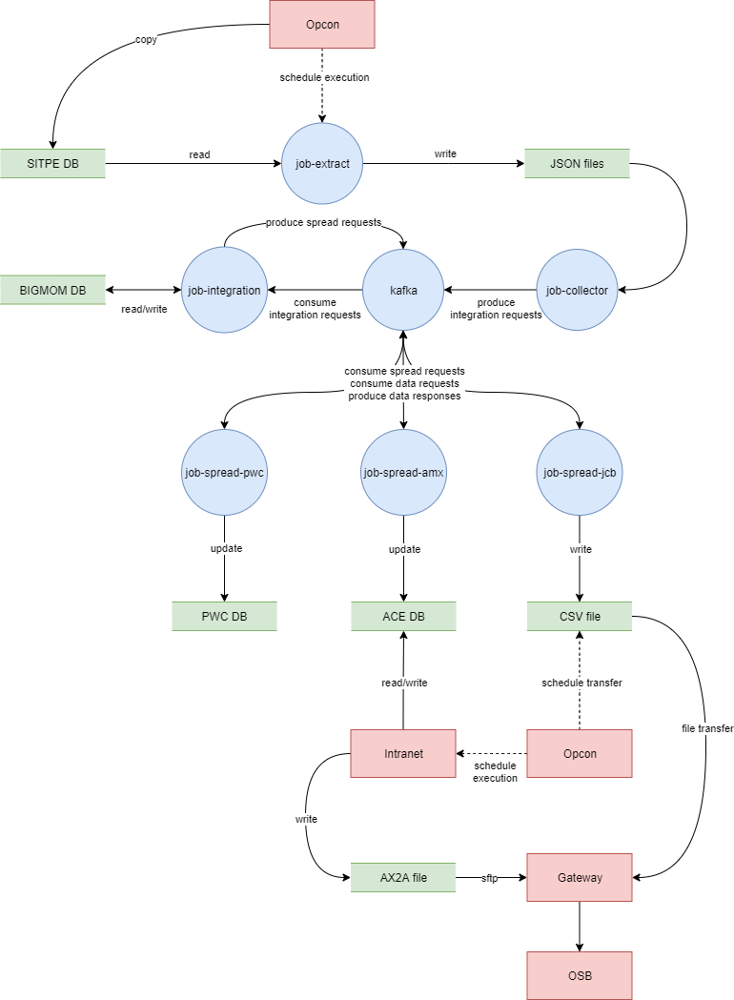

# Bigmom - Spécifications techniques

Cette page décrit les spécification techniques de Bigmom.

1. [Accueil](README.md)
2. [Spécification fonctionnelles](functional_spec.md)
3. [Spécification techniques](technical_spec.md)
4. [Architecture](architecture.md)
5. [Infrastructure](infrastructure.md)

## Plan de télécollectes

La chaîne de traitement du plan de télécollectes est composée de quatre parties :
- L'intégration des données du SITPE
- Le calcul du plan de télécollectes
- La diffusion des heures de télécollectes
- La récupération des données des systèmes externes

### Intégration des données

Le processus d'intégration des données consiste à extraire les informations des commerçants du SITPE, pour les intégrer dans Bigmom, ceci afin de calculer le plan de télécollectes. L'intégration des données est lancée quotidiennement par un schedule Opcon.

Pour commencer, le `job-extract` est chargé d'extraire les informations du SITPE et de les restituer dans des fichiers JSON. Il produit trois fichiers :
- Un fichier contenant tous les commerçants
- Un fichier contenant tous les TPEs
- Un fichier contenant tous les contrats

Ensuite, le `job-collector` collecte ces fichiers JSON pour mettre en corrélation TPEs et contrats des commerçants, puis met en forme les données et produit un message de type `commerce integration request` pour intégration dans Bigmom.

Les `commerce integration request` sont constituées comme suit :

```json
{
  "guid": "31ddfe1e-72e7-472f-92aa-8f6b2adc31cd",
  "index": 1,
  "total": 4586,
  "commerce": { }
}
```

| Champ      | Description                                                      |
| ---------- | ---------------------------------------------------------------- |
| `guid`     | L'identifiant commun à tous les messages d'une même intégration. |
| `index`    | La position du message parmi tous les autres.                    |
| `total`    | Le nombre total de message dans l'intégration.                   |
| `commerce` | Le payload du commerce.                                          |

Chaque `commerce integration request` produit par le `job-collector` est traité par le `job-integration` dans un pipeline. Le schéma ci-dessous illustre ce pipeline :



A la fin du pipeline, les actions suivantes sont effectuées : 
- Si le commerce a été ajouté ou modifié dans Bigmom, un message de type `data request` est produit pour toutes les applications rattachées à des contrat nécessitant des données venant de systèmes externes.
- Si le commerce a été ajouté ou modifié dans Bigmom, un message de type `commerce index request` est produit pour réindexer le commerce dans le moteur de recherche.
- Si le message traité est le dernier dans l'intégration, le calcul des heures de télécollectes est déclenché en produisant un message de type `balance request`.

Cela conclut le processus d'intégration des données.

### Calcul du plan de télécollectes

Le processus de calcul du plan de télécollectes commence quand est produit un message de type `balance request`. C'est un message qui est produit est consommé par le `job-integration` lorsqu'une intégration s'est terminé correctement.

Les `balance request` sont constituées comme suit :

```json
{
  "date": "2021-11-25",
  "force": false
}
```

| Champ   | Description                                                                                                                                                                                       |
| ------- | ------------------------------------------------------------------------------------------------------------------------------------------------------------------------------------------------- |
| `date`  | La date à laquele le plan de télécollectes est calculé. Elle sert à écarter les contrat et commerçant résiliés passés cette date.                                                                 |
| `force` | Force la mise à jour des heures de télécollectes pour toutes les applications, même si elles sont identiques. Cela aura pour effet de produire une `spread request` pour toutes les applications. |

Sur consommation d'une `balance request`, le `job-integration` va calculer une heure de télécollecte pour toutes les applications selon l'algorithme décris plus haut. Pour chaque application ayant vu son heure de télécollecte modifiée par le calcul ou si le forçage est activé, un message appelé `spread request` est produit. Ils sont consommés par les `spread jobs` dans le processus de diffusion des heures de télécollectes.

Cela conclut le processus de calcul du plan de télécollectes.

### Diffusion des heures de télécollectes

Le processus de diffusion des heures de télécollectes commence après le calcul du plan de télécollectes. Les message de type `spread request` sont consommés par les `spread jobs`. 

Les `spread request` sont constituées comme suit :

```json
{
  "trace_identifier": "4126109d-9627-45a3-8fe6-4cadaf6534dd",
  "commerce_id": "3355150",
  "no_serie_tpe": "16117CT25401196",
  "no_site_tpe": "001",
  "no_contrat": "3355150",
  "application_code": "EMV",
  "heure_tlc": "2021-09-28T22:19:00+00:00",
  "ef": "018319"
}
```

| Champ              | Description                                                                                                |
| ------------------ | ---------------------------------------------------------------------------------------------------------- |
| `trace_identifier` | Un identifiant de suivi permettant au `job-integration` de corréler les réponses des jobs avec les traces. |
| `commerce_id`      | L'identifiant commerçant.                                                                                  |
| `no_serie_tpe`     | Le numéro de série du TPE.                                                                                 |
| `no_site_tpe`      | Le numéro de site ou de rang du TPE.                                                                       |
| `no_contrat`       | Le numéro de contrat monétique.                                                                            |
| `application_code` | Le code de l'application.                                                                                  |
| `heure_tlc`        | L'heure de télécollecte calculée. La date n'est présente que pour indiquer quand a été calculée l'heure.   |
| `ef`               | L'établissement financier du commerçant.                                                                   |

Pour chaque `spread request` qu'il emet, le `job-integration` créé une `spread trace` en base de données. Elles sont constituées comme suit :

```json
{
  "id": "4126109d-9627-45a3-8fe6-4cadaf6534dd",
  "payload": { },
  "heure_tlc": "22:19:00",
  "created_at": "2021-09-28T02:42:56.005673+00:00",
  "application_id": 2468
}
```

| Champ            | Description                                                     |
| ---------------- | --------------------------------------------------------------- |
| `id`             | L'identifiant de suivi. Correspond au champ `trace_identifier`. |
| `payload`        | Le payload. Correspond au contenu de la `spread request`.       |
| `heure_tlc`      | L'heure de télécollecte calculée.                               |
| `created_at`     | La date à laquelle la trace a été créé.                         |
| `application_id` | L'id de l'application en base de données.                       |

Ces traces permettent au `job-integration` de rattacher les réponses des `spread jobs`. 

Les `spread jobs` répondent avec un message de type `spread response`. Il est constitué comme suit :

```json
{
  "job": "job-spread-pwc",
  "status": "UPDATED",
  "error": null,
  "trace_identifier": "4126109d-9627-45a3-8fe6-4cadaf6534dd"
}
```

| Champ              | Description                                                     |
| ------------------ | --------------------------------------------------------------- |
| `job`              | Le job ayant répondu.                                           |
| `status`           | Le statut du traitement (UPDATED, IGNORED, ERROR).              |
| `error`            | L'erreur survenue si le statut est ERROR.                       |
| `trace_identifier` | L'identifiant de suivi.                                         |

Un statut `UPDATED` indique que le `spread job` a correctement mis à jour l'heure de télécollecte dans le système cible.

Un statut `IGNORED` indique que le `spread job` a ignoré la `spread request` car il n'était pas en mesure de la traiter dans le système cible.

Un statut `ERROR` indique que le `spread job` a rencontré une erreur lors du traitement de la `spread request` avec le système cible.

Chacun des `spread jobs` est en mesure de traiter une ou plusieurs applications selon leur code, et ignore celles qu'ils ne savent pas traiter.

Le `job-spread-pwc` traite les applications suivantes :
- EMV
- NFC
- VAD
- JADE

Le `job-spread-amx` traite les applications suivantes :
- AMX

Le `job-spread-jcb` traite les applications suivantes :
- JCB

Pour chaque `spread response` qu'il recoit, le `job-integration` créé une `spread trace response` en base de données. Elles sont constituées comme suit :

```json
{
  "id": "28993630-5d95-4f3b-b159-022415fc9254",
  "job": "job-spread-pwc",
  "status": "UPDATED",
  "error": null,
  "trace_id": "4126109d-9627-45a3-8fe6-4cadaf6534dd",
  "created_at": "2021-09-28T02:42:57.862532+00:00"
}
```

| Champ        | Description                                                                               |
| ------------ | ----------------------------------------------------------------------------------------- |
| `id`         | Un identifiant unique généré par le `job-integration` lors de l'ajout en base de données. |
| `job`        | Le job ayant répondu.                                                                     |
| `status`     | Le statut du traitement (UPDATED, IGNORED, ERROR).                                        |
| `error`      | L'erreur survenue si le statut est ERROR.                                                 |
| `trace_id`   | L'id de la `spread trace` retrouvé avec l'identifiant de suivi.                           |
| `created_at` | La date à laquelle la réponse a été créé.                                                 |

De cette façon, le `job-integration` est capable de tracer entièrement tous les échanges qu'il effectue avec les `spread jobs`.
Il est ainsi aisé de déboguer les eventuels problèmes.

Le `job-spread-pwc` est responsable des mises à jours des heures de télécollectes dans la base de données de Powercard. Les nouvelles seront prises en compte par les TPE dès leur prochaine télécollecte.

Le `job-spread-amx` est responsable des mises à jours des heures de télécollectes dans l'intranet. Pour que les nouvelles heures de télécollectes soient prises en compte, le fichier AX2A doit être généré est mis à disposition de l'OSB. Cette action est réalisée quotidiennement par un schedule Opcon.

Le `job-spread-jcb` est responsable des mises à jours des heures de télécollectes pour le périmètre JCB. Pour cela, il va récupérer les informations des adhérent JCB dans l'intranet et génère un fichier CSV contenant les nouvelles heures de télécollectes. Pour qu'elles soient prises en compte, le fichier CSV doit être est mis à disposition de l'OSB. Cette action est réalisée quotidiennement par un schedule Opcon.

### Récupération des données des systèmes externes

### Flowchart

Le diagramme de flux illustre le cheminement complet dans données dans la chaîne de traitement :



## Supervision des télécollectes

TODO: Write technical spec